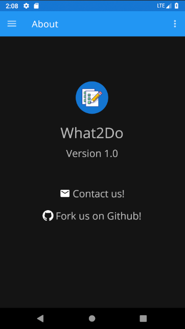

# What2Do

A Material Design inspired todo notes app written in Kotlin

The app will work on devices running Android M (API Level 21) to Android P (API Level 28)

Note that the app uses AndroidX with the Google Material Design library

### Libraries used
* [Room database](https://developer.android.com/topic/libraries/architecture/room)
* [Text drawables](https://github.com/amulyakhare/TextDrawable)
* [Timber for logging](https://github.com/JakeWharton/timber)
* [Material Date & Time Picker](https://github.com/wdullaer/MaterialDateTimePicker)
* [InflationX for custom fonts](https://github.com/InflationX/Calligraphy)
* [RecyclerView animators](https://github.com/wasabeef/recyclerview-animators)

All icons and images used in this app are either taken from the in-built icon set or have been taken from [IconFinder](https://www.iconfinder.com/)

### Screenshots

